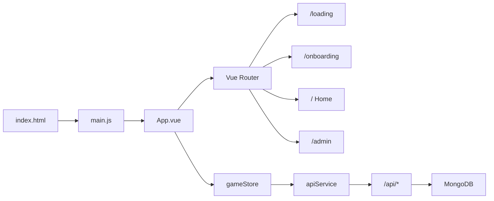

# Структура проекта

Справочник по составу репозитория и навигации по коду.

---

## 1. Описание проекта

| Параметр | Значение |
|----------|----------|
| **Название** | Тапалка пассивного дохода |
| **Тип** | Telegram Mini App (игра) |
| **Назначение** | Tap-игра: баланс, энергия, уровни, бусты, задачи, продукты, рефералы, раздел «Рост» (инвестиции). |

**Стек:**

- **Frontend:** Vue 3, Vite, Pinia, Vue Router
- **Backend:** Vercel Serverless Functions (папка `api/`), MongoDB (Mongoose)
- **Интеграция:** Telegram Web App API, шрифт Roboto

---

## 2. Дерево каталогов

```
frontend/
├── .env
├── .gitignore
├── admin.js                 # Точка входа админ-приложения (Vue для /admin)
├── index.html               # Точка входа основного приложения
├── jsconfig.json            # Алиас @ → src
├── package.json
├── package-lock.json
├── vite.config.js
├── vercel.json              # Деплой: сборка, rewrites для /api, /admin, SPA
├── PROJECT_STRUCTURE.md     # Этот файл
│
├── api/                     # Vercel Serverless Functions (бэкенд)
│   ├── users/
│   ├── referrals.js
│   ├── stats/
│   ├── settings/
│   └── admin/
│       ├── users/
│       ├── notifications/
│       ├── products/
│       └── tasks/
│
├── public/                  # Статика (копируется в dist как есть)
│   ├── assets/              # base.css, main.css, logo.svg, images/
│   ├── _redirects
│   └── admin/
│       └── index.html       # HTML для админки (если используется отдельная сборка)
│
├── dist/                    # Результат vite build (не коммитить)
│
└── src/                     # Исходники фронтенда и общая логика
    ├── main.js              # Точка входа: Vue, Router, Pinia, роуты, guards
    ├── App.vue               # Корень приложения, провайдеры, модалки
    ├── admin/
    │   └── main.js          # Альтернативная точка входа админки
    ├── assets/
    ├── components/
    ├── composables/
    ├── data/
    ├── layouts/
    ├── lib/
    ├── models/
    ├── pages/
    ├── services/
    └── stores/
```

---

## 3. Раздел `src/`

### 3.1 Точка входа и корень приложения

| Файл | Назначение |
|------|------------|
| [src/main.js](src/main.js) | Создание Vue-приложения, Router, Pinia. Регистрация маршрутов и `beforeEach`: проверка `appLoaded` → `/loading`, затем `onboardingCompleted` → `/onboarding`, для `/admin` — проверка токена через `ApiService.checkAuth`. Настройка Telegram WebApp (expand, backgroundColor, enableClosingConfirmation). |
| [src/App.vue](src/App.vue) | Корневой компонент: экран «Загрузка...» до синхронизации (кроме админки и dev). `NotificationsProvider`, глобальные модалки `ProductModal` и `TaskModal`. Provide: `logger`, `productModal`, `taskModal`. В `onMounted`: `store.syncFromServer(userId)` и запуск таймера регенерации энергии. |

### 3.2 Маршруты (из main.js)

| Путь | Компонент | Мета |
|------|-----------|------|
| `/` | Home | requiresOnboarding |
| `/loading` | LoadingPage | — |
| `/onboarding` | OnboardingPage | — |
| `/boost` | Boost | requiresOnboarding |
| `/growth` | Growth | requiresOnboarding |
| `/friends` | Friends | requiresOnboarding |
| `/tasks` | Tasks (lazy) | requiresOnboarding |
| `/products` | Products (lazy) | requiresOnboarding |
| `/admin` | AdminLayout | requiresAuth |
| `/admin` (child ``) | Admin | — |
| `/admin/login` | AdminLogin | — |

### 3.3 Страницы (`src/pages/`)

| Файл | Назначение |
|------|------------|
| Home.vue | Главный экран игры (тап, баланс, энергия, навигация). |
| Boost.vue | Раздел бустов (tap 3x, 5x и т.д.). |
| Growth.vue | Раздел «Рост» — инвестиции по категориям (данные из `investmentsData.js`). |
| Friends.vue | Реферальная механика. |
| Tasks.vue | Список заданий и выполнение. |
| Products.vue | Каталог продуктов и клеймы. |
| LoadingPage.vue | Экран загрузки до инициализации приложения. |
| OnboardingPage.vue | Онбординг новых пользователей. |
| Admin.vue | Админ-панель (секции: пользователи, задачи, продукты, инвестиции, статистика, настройки, уведомления). |
| AdminLogin.vue | Вход в админку (токен). |

### 3.4 Layouts (`src/layouts/`)

| Файл | Назначение |
|------|------------|
| AdminLayout.vue | Обёртка для роутов админки (общий layout с роутером для дочерних страниц). |

### 3.5 Компоненты (`src/components/`)

Сгруппированы по смыслу:

- **layout:** Header.vue, Navigation.vue  
- **game:** TapArea.vue, Balance.vue, StatusBar.vue, EnergyBar.vue, ProductClaimModal.vue  
- **admin:** AdminPanel.vue, UsersSection.vue, TasksSection.vue, ProductsSection.vue, InvestmentsSection.vue, StatsSection.vue, SettingsSection.vue, NotificationsSection.vue, ProductsView.vue, NotificationStats.vue; модалки: TaskModal.vue, ProductModal.vue, InvestmentModal.vue, ConfirmModal.vue (в `admin/modals/`)  
- **modals (глобальные из App.vue):** TaskModal.vue, ProductModal.vue (в `modals/`)  
- **notifications:** ProductNotification.vue, NotificationsContainer.vue, NotificationPopup.vue  
- **onboarding:** Onboarding.vue (в `onboarding/`)  
- **ui:** BaseCard.vue, BaseButton.vue, BaseModal.vue, BaseForm.vue, FormGroup.vue, StatCard.vue, CoinIcon.vue, LoadingSpinner.vue, Notification.vue (в `ui/`)  
- **icons:** IconEcosystem.vue, IconDocumentation.vue, IconTooling.vue, IconSupport.vue, IconCommunity.vue (в `icons/`)  
- **прочие:** NotificationsProvider.vue, Logger.vue, Loading.vue, Tutorial.vue  

### 3.6 Сторы (`src/stores/`)

| Файл | Назначение |
|------|------------|
| gameStore.js | Основной стейт игры: balance, passiveIncome, energy, level, multipliers, boosts, задачи, продукты, рефералы. Синхронизация с API (`syncFromServer`), таймер регенерации энергии, локальное сохранение через StorageService, настройки из GameSettingsService. |
| adminStore.js | Стейт админ-панели: пользователи, задачи, продукты, уведомления, настройки, статистика и действия с ними через API. |

### 3.7 Сервисы (`src/services/`)

| Файл | Назначение |
|------|------------|
| apiService.js | Работа с `/api`: fetchUserFromServer, updateUserBalance, методы для задач, продуктов, уведомлений, настроек, checkAuth и др. |
| storage.js | Локальное сохранение/загрузка (localStorage). |
| userService.js | Логика работы с пользователем. |
| referralService.js | Реферальная логика. |
| telegramService.js | Интеграция с Telegram Web App. |
| GameSettingsService.js | Чтение/кэш глобальных настроек игры (tapValue, baseEnergy, energyRegenRate, levelRequirements, бусты и т.д.). |

### 3.8 Composables (`src/composables/`)

| Файл | Назначение |
|------|------------|
| useApi.js | Композабл для API-запросов. |
| useTelegram.js | Композабл для Telegram Web App. |
| useNotifications.js | Композабл для уведомлений. |

### 3.9 Модели (`src/models/`)

Используются на фронте и в `api/` (Mongoose-схемы):

User.js, Product.js, Task.js, Notification.js, GameSettings.js, ProductClaim.js, Referral.js.

### 3.10 Библиотеки (`src/lib/`)

| Файл | Назначение |
|------|------------|
| dbConnect.js | Подключение к MongoDB (кэш соединения). Вызывается из обработчиков в `api/`. |

### 3.11 Данные (`src/data/`)

| Файл | Назначение |
|------|------------|
| investmentsData.js | Статические данные для раздела «Рост»: категории (финансы, крипто и т.д.) и элементы инвестиций (id, name, baseIncome, level, cost, multiplier, image). |

---

## 4. Раздел `api/` (Backend)

Каждый файл/папка — отдельная Vercel Serverless Function. Импорты: `@/lib/dbConnect`, `@/models/*` (путь `@` резолвится в `src/`).

Формат ответов: `{ success, data }` или `{ success, data: { gameData } }`. Фронт обрабатывает их в `apiService.js` и `gameStore`.

### 4.1 Публичные (игровые) эндпоинты

| Путь | Методы | Назначение |
|------|--------|------------|
| api/users/index.js | GET, POST | Список пользователей, создание пользователя. |
| api/referrals.js | — | Реферальная логика. |
| api/stats/index.js | GET | Статистика. |
| api/settings/index.js | GET, PUT | Глобальные настройки игры (GameSettings): получение/обновление. |

### 4.2 Пользователь по идентификатору

| Путь | Методы | Назначение |
|------|--------|------------|
| api/admin/users/[telegramId].js | GET, PATCH | Получение/обновление пользователя по `telegramId` (в т.ч. `gameData`). |
| api/admin/users/[id].js | GET, PUT, DELETE | Получение/обновление/удаление пользователя по id. |
| api/admin/users/index.js | — | Список/действия по пользователям (в т.ч. topup и др.). |

### 4.3 Админка: уведомления, продукты, задачи

| Путь | Назначение |
|------|------------|
| api/admin/notifications/index.js | GET список уведомлений, POST создание и рассылка по условиям (level, income). |
| api/admin/notifications/send.js | Отправка уведомлений. |
| api/admin/notifications/test.js | Тестовый эндпоинт уведомлений. |
| api/admin/products/index.js | GET список продуктов, POST создание; в том же или в [id] — GET/PUT/DELETE по продукту. |
| api/admin/products/claim.js | Клейм продукта пользователем. |
| api/admin/products/claims/user/[userId].js | Клеймы по пользователю. |
| api/admin/tasks/index.js | CRUD по задачам. |
| api/admin/tasks/user/[userId].js | Задачи по пользователю. |

---

## 5. Сборка и деплой

- **Скрипты (package.json):**  
  - `npm run dev` — Vite, порт 5174.  
  - `npm run build` — сборка в `dist`.  
  - `vercel-build` — то же для Vercel.

- **Vercel (vercel.json):**  
  - Сборка: `@vercel/static-build`, `distDir: "dist"`.  
  - Rewrites: `/assets/*` → assets, `/api/*` → API, `/admin/*` → `/admin.html`, остальное → `/index.html`.

- **Разработка:** в `vite.config.js` запросы `/api` проксируются на `https://tabinvestproject.ru` (чтобы не поднимать бэкенд локально).

---

## 6. Админка отдельно

- **Точка входа:** [admin.js](admin.js) — отдельное Vue-приложение с базовым URL `/admin`, Router, Pinia. Монтируется в свой HTML (например, при отдельной сборке — в `public/admin/index.html` или в корень как `admin.html`).  
- **Роуты:** `/` (Admin), `/login` (AdminLogin).  
- **Защита:** `router.beforeEach` — при отсутствии токена или при неуспешном `ApiService.checkAuth(token)` редирект на `/admin/login`.  
- **UI:** страницы Admin, AdminLogin; остальной интерфейс — компоненты в `src/components/admin/`.

---

## 7. Схема потока приложения



Переходы: при первом заходе приложение попадает на `/loading`, после флага `appLoaded` — на `/onboarding` (если не пройден), затем на главный экран или выбранный роут. Запросы к серверу идут из `gameStore` и компонентов через `apiService` к Vercel-функциям в `api/`, те работают с MongoDB через `dbConnect` и модели из `src/models/`.
